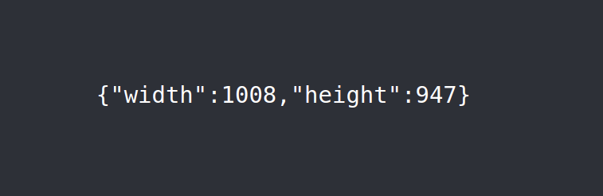

# react-element-size

React hook to get size of any element.

## Installation

```
yarn add react-element-size
```

## Usage

```javascript
import React from "react";
import useElementSize from "react-element-size";

function App() {
  const { setRef, size } = useElementSize();
  return (
    <div className="App">
      <header className="App-header" ref={setRef}>
        <pre>{JSON.stringify(size)}</pre>
      </header>
    </div>
  );
}


