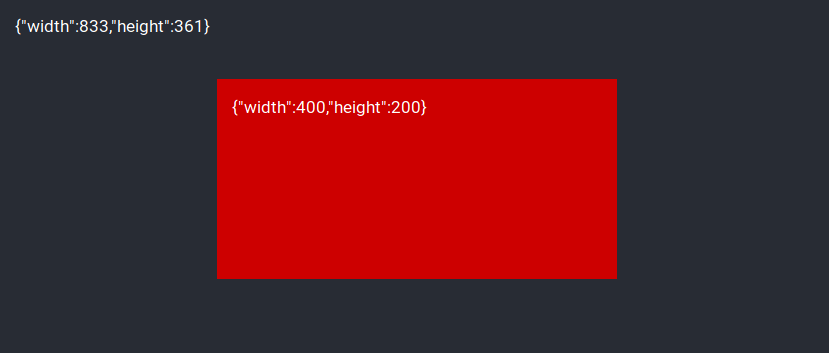

# react-element-size

React hook to get size of any element.

## Installation

```
yarn add react-element-size
```

## Usage

```javascript
import React from "react";
import useElementSize from "react-element-size";

export default function App() {
  const app = useElementSize();
  const box = useElementSize();
  return (
    <div className="App" ref={app.setRef}>
      <span>{JSON.stringify(app.size)}</span>
      <div className="Box" ref={box.setRef}>
        <span>{JSON.stringify(box.size)}</span>
      </div>
    </div>
  );
}
```


